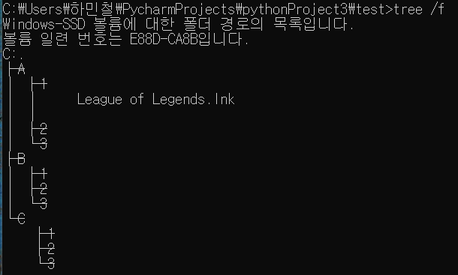
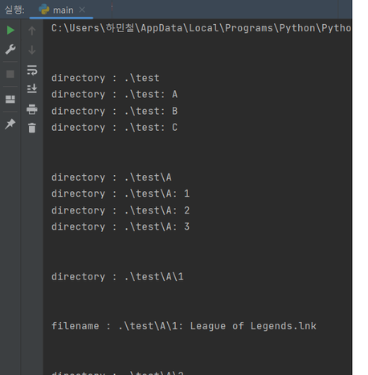

# Reducing the size of all photo files in a directory (Python) 
---
## Description
<br>
디렉토리의 모든 하위 디렉토리를 탐색하고 OpenCV를 사용하여 이미지를 자르고 새 그림을 저장하는 코드입니다.
<br>
사진에서 불필요한 부분을 삭제하여 이미지 파일 용량을 1/10로 줄일 수 있습니다.
<br>
<br>
This is the code that traverses all subdirectories of a directory, crops the image using OpenCV, and saves a new picture. 
It can be reduced to 1/10 of the capacity by deleting the useless part of the photo.
<br>
<br>


### 🔳Code Analysis

<br>
아래 기능들을 적절하게 mixing 하여 코드를 제작하였습니다.
<br>
The code was created by mixing the functions below appropriately.
<br>

#### 💻Image Cropping Code
```python
import cv2
import numpy as np

img = cv2.imread("313-2-1-15-Z99_A-0000001.jpg")
rows, cols, _ = img.shape
#이미지 크기 출력
print("Rows", rows)
print("Cols", cols)

#이미지 자르기
cut_image=img[200:950, 800:1200]
#200:950, 800:1200 = 상:하, 좌:우

cv2.imshow("Cut Image",cut_image)

#원본 이미지
#cv2.imshow("image", img)

cv2.waitKey(0) #입력 있을 때까지 대기

```
<br>

#### 💻 Save Code

일단 crop된 이미지를 cut_image로 저장해보았습니다.
<br>
I tried to save the cropped image as cut_image.

<br>

```python
#저장
save_file = 'img_crop.jpg' #저장할 이름
cv2.imwrite(save_file, cut_image) #파일로 저장
```
<br>

#### 💻 Image Reduction Code
그리고 그 crop된 이미지의 size를 줄여보았습니다. 0.6으로 줄였고, 그것을 따로 scaledown_img.jpg로 저장했습니다.
<br>
And I tried reducing the size of the cropped image. I reduced it to 0.6 and saved it separately as scaledown_img.jpg.

```python
#resizing 코드
scaledown_img = cv2.resize(cut_image, None, fx=scaleX, fy=scaleY, interpolation = cv2.INTER_LINEAR)
cv2.imshow("Scale Down", scaledown_img)

#scaledown 한 img 저장
save_file = 'img_crop_scaledown.jpg' #저장할 이름
cv2.imwrite(save_file, scaledown_img) #파일로 저장

#저장
save_file = 'img_crop_scaledown.jpg' #저장할 이름
cv2.imwrite(save_file, scaledown_img) #파일로 저장

```
<br>

#### 💻 Folder Traversal Code
폴더를 순회하는 코드입니다. 
<br>
This is the code to iterate through the folders.
```python
import os
for folder_name, subfolders, filenames in os.walk('.\\test'):
    print('\n')
    print('directory : ' + folder_name)
    
    #subfolder
    for subfolder in subfolders: 
        print('directory : '+folder_name + ': '+ subfolder)

    #file in folder
    for filename in filenames:
        print('filename : ' + folder_name + ': ' + filename)
```

<br>
테스트 폴더를 순회해보겠습니다. 트리 구조는 다음과 같습니다. 
<br>
Let's iterate through the test folder. The tree structure is as follows.
<br>
<br>



<br>
코드 실행 결과입니다. test의 하위 디렉토리에 있는 League Of Legend 파일을 잘 출력하는 모습을 볼 수 있습니다.
<br>
The result of running the code. You can see that the League Of Legend file in the subdirectory of test outputs just fine.
<br>
<br>


