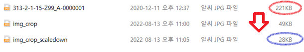

# Reducing the size of all photo files in a directory (Python) 
---
## Description
<br>
This is the code that traverses all subdirectories of a directory, crops the image using OpenCV, and saves a new picture.
<br>
It can be reduced to 1/10 of the capacity by deleting the useless part of the photo.
<br>
<br>



### 🔳Code Analysis
<br>

#### 💻Image Cropping Code
```python
import cv2
import numpy as np

img = cv2.imread("313-2-1-15-Z99_A-0000001.jpg")
rows, cols, _ = img.shape
#이미지 크기 출력
print("Rows", rows)
print("Cols", cols)

#이미지 자르기
cut_image=img[200:950, 800:1200]
#200:950, 800:1200 = 상:하, 좌:우

cv2.imshow("Cut Image",cut_image)

#원본 이미지
#cv2.imshow("image", img)

cv2.waitKey(0) #입력 있을 때까지 대기

```
<br>

#### 💻 Save Code

일단 crop된 이미지를 cut_image로 저장해보았습니다.
<br>

```python
#저장
save_file = 'img_crop.jpg' #저장할 이름
cv2.imwrite(save_file, cut_image) #파일로 저장
```
<br>

#### 💻 Image Reduction Code
그리고 그 crop된 이미지의 size를 줄여보았습니다. 0.6으로 줄였고, 그것을 따로 scaledown_img.jpg로 저장했습니다.

```python
#resizing 코드
scaledown_img = cv2.resize(cut_image, None, fx=scaleX, fy=scaleY, interpolation = cv2.INTER_LINEAR)
cv2.imshow("Scale Down", scaledown_img)

#scaledown 한 img 저장
save_file = 'img_crop_scaledown.jpg' #저장할 이름
cv2.imwrite(save_file, scaledown_img) #파일로 저장

#저장
save_file = 'img_crop_scaledown.jpg' #저장할 이름
cv2.imwrite(save_file, scaledown_img) #파일로 저장

```
<br>

#### 💻 Folder Traversal Code
폴더를 순회하는 코드입니다. 
```python
import os
for folder_name, subfolders, filenames in os.walk('.\\test'):
    print('\n')
    print('directory : ' + folder_name)
    
    #subfolder
    for subfolder in subfolders: 
        print('directory : '+folder_name + ': '+ subfolder)

    #file in folder
    for filename in filenames:
        print('filename : ' + folder_name + ': ' + filename)
```
<br>


<br>


